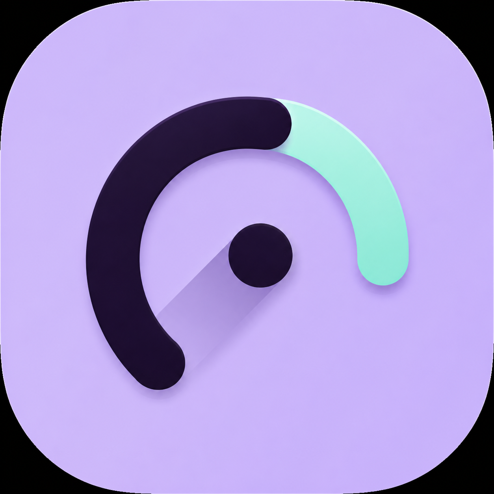

<p align="center">
  
</p>

<h1 align="center">materialSpeed</h1>

<p align="center">
  
  
  
</p>

materialSpeed is a minimal native speed test app for macOS.

It checks your connection speed, shows the current result in a compact interface, and keeps a short local history of recent tests.

## What It Measures

- Download speed
- Upload speed
- Ping
- Jitter

Tests use Cloudflare speed test endpoints. Results can vary depending on your network, Wi-Fi quality, VPN, provider routing, and current server load.

## Requirements

- macOS 13 Ventura or newer
- Internet connection

## Installation

Download the latest `materialSpeed.app` from the Releases page and move it to your Applications folder.

If macOS warns that the app cannot be opened because it was downloaded from the internet, open it from Finder with right click, then choose Open.

## Usage

Open materialSpeed and press the start button. The app will measure latency first, then download speed, then upload speed.

Completed tests are saved in local history inside the app. You can open history with the clock button and clear it at any time.

## Privacy

materialSpeed does not require an account and does not collect personal data.

The app stores test history locally on your Mac using system app storage. Speed measurements connect to Cloudflare speed test endpoints to perform the network test.

## Build From Source

For users who prefer building the app themselves:

```bash
swift run
```

To create a local macOS app bundle:

```bash
./package_app.sh
open dist/materialSpeed.app
```

## License

materialSpeed is released under the MIT License.
